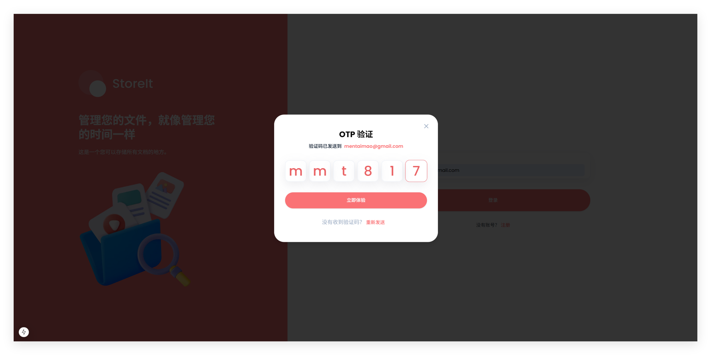
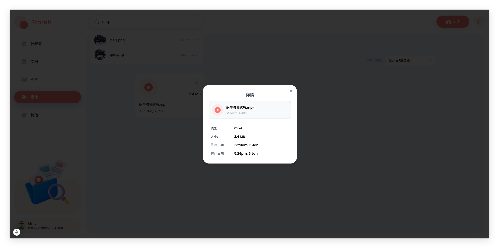

# 存储和文件共享平台

## 🔋 效果图






## 🤖 介绍

- 🌟 技术栈: Next.js + Appwrite + ShadCN
- 🎃 文件管理: 支持文件上传、分类、搜索和排序
- 🔥 响应式设计: 完美适配桌面端和移动端
- 👾 用户认证: 基于OTP验证码的安全登录系统
- 🚀 性能优化: 实现数据缓存和组件优化
- 🐞 文件预览: 支持多种文件类型的预览和下载

## 🔧 安装与运行

### 前置要求

- Node.js 18+
- Appwrite 服务器(本地或云端)

### 安装步骤

1. 克隆仓库

```bash
git clone <repository-url>
cd storage-management
```

2. 安装依赖

```bash
npm install
```

3. 配置环境变量

在根目录下创建 `.env.local` 文件, 并添加以下环境变量:

```bash
NEXT_PUBLIC_APPWRITE_ENDPOINT = "https://nyc.cloud.appwrite.io/v1"
NEXT_PUBLIC_APPWRITE_PROJECT = ""
NEXT_PUBLIC_APPWRITE_PROJECT_NAME = ""
NEXT_PUBLIC_APPWRITE_DATABASE = ""
NEXT_PUBLIC_APPWRITE_USERS_COLLECTION = ""
NEXT_PUBLIC_APPWRITE_FILES_COLLECTION = ""
NEXT_PUBLIC_APPWRITE_BUCKET = ""
NEXT_APPWRITE_KEY = ""
```

具体 key 请替换为实际的 Appwrite 凭据, 可以在 [Appwrite](https://appwrite.io/) 上注册并创建一个新项目来获取对应的 key

4. 启动项目

```bash
npm run dev
```

## 许可证

MIT License
